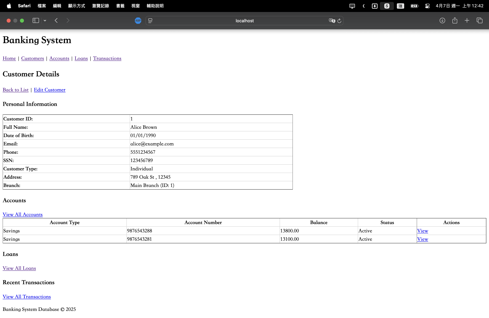

# Banking System Management

This project is a comprehensive implementation of a banking system database with a graphical user interface (GUI) for database management operations. Developed as part of a Database Design and Management course, it demonstrates advanced database concepts including inheritance relationships, transaction management, stored procedures, views, functions, triggers, and data encryption.

## Table of Contents
- [Project Overview](#project-overview)
- [Database Design](#database-design)
- [Database Features](#database-features)
- [Technologies Used](#technologies-used)
- [Setup and Installation](#setup-and-installation)
- [Project Structure](#project-structure)
- [Application Features](#application-features)
- [Screenshots](#screenshots)
- [Future Enhancements](#future-enhancements)

## Project Overview

The Banking System Database Management project provides a functional GUI for performing CRUD (Create, Read, Update, Delete) operations on a comprehensive banking database. The system allows for managing various banking entities such as customers, accounts, loans, and transactions, while enforcing complex business rules and securing sensitive financial data.

## Database Design

The database is designed to model a full-featured banking system using SQL Server's capabilities for complex relationships and inheritance.


### Key Entities:
- **Customer**: Information about bank customers (individuals and businesses)
- **Financial Instrument**: A supertype entity for different financial products
  - **Account**: Checking, savings, or money market accounts
  - **Loan**: Student, business, vehicle, and mortgage loans
  - **Credit Card**: Customer credit cards with limits and balances
  - **Insurance**: Health, property, and vehicle insurance products
- **Branch**: Bank branch information
- **Employee**: Bank staff information with management hierarchy
- **Transaction**: Financial transactions linked to instruments
- **Customer_Financial_Instrument**: Association table linking customers to financial products
- **Beneficiary**: Information about account beneficiaries
- **Online_Banking**: Customer online banking credentials and settings
- **Investment**: Customer investment portfolios

### Inheritance Relationships:
The database implements inheritance using SQL Server's approach to table inheritance:
- **Financial_Instrument** is the supertype for all financial products
- **Account**, **Loan**, **Insurance**, and **Credit_Card** are subtypes of Financial_Instrument
- Further specialization: **Student_Loan**, **Business_Loan**, **Vehicle_Loan**, and **Mortgage_Loan** are subtypes of Loan
- Similarly, **Health_Insurance**, **Property_Insurance**, and **Vehicle_Insurance** inherit from Insurance

### Constraints and Data Integrity:
- Foreign key constraints to maintain referential integrity
- Check constraints to enforce business rules
- Default values for common fields
- NOT NULL constraints for required data
- Unique constraints to prevent duplicates

## Database Features

### Data Security:
- **Encryption**: Sensitive data such as SSNs, account numbers, and passwords are encrypted using SQL Server's encryption features
- **Master Key and Certificate**: Database-level security with proper key management
- **Symmetric Keys**: Different encryption keys for different types of sensitive data (PII, financial, authentication)

### Performance Optimization:
- **Strategic Indexing**: Non-clustered indexes on frequently queried columns
- **Filtered Indexes**: For efficient queries on subsets of data (e.g., active loans)
- **Composite Indexes**: For multi-column search conditions
- **Covering Indexes**: Using INCLUDE to avoid lookups

### Advanced SQL Features:
- **Stored Procedures**:
  - `GetCustomerAccountSummary`: Retrieves account summary for a customer
  - `TransferMoney`: Handles money transfers between accounts with transaction management
  - `ProcessLoanApplication`: Processes new loan applications
  - `UpdateAccountBalance`: Updates account balances based on transactions
  - `GetCustomerLoanDetails`: Retrieves loan details for a customer

- **Views**:
  - `CustomerAccountsView`: Summarizes customer account information
  - `LoanSummaryView`: Provides an overview of all loans
  - `TransactionHistoryView`: Shows transaction history with customer details
  - `BranchEmployeeSummaryView`: Employee information by branch
  - `CustomerInvestmentSummaryView`: Customer investment portfolios

- **User-Defined Functions**:
  - `CalculateMonthlyPayment`: Calculates loan monthly payments
  - `CalculateYearlyInterest`: Computes annual interest on accounts
  - `GetCustomerAge`: Determines customer age from date of birth
  - `CalculateLoanInterest`: Calculates total interest on a loan
  - `GetBranchEmployeeCount`: Counts employees at a specific branch

- **Triggers**:
  - `AuditTransactionTrigger`: Adds audit information to transactions
  - `EnforceTransactionStatusRules`: Ensures valid transaction status changes

## Technologies Used

- **Java 21**: Core programming language
- **Spring Boot 3.4.4**: Framework for building the application
- **Hibernate/JPA**: ORM for database interaction
- **Microsoft SQL Server**: Database management system
- **JSP/JSTL**: For building web pages
- **Maven**: Dependency management and build tool
- **Spring MVC**: Web application architecture

## Setup and Installation

### Prerequisites:
- Java Development Kit (JDK) 21
- Spring Tool Suite (STS) or Eclipse with Spring Tools
- Microsoft SQL Server 2019 or later
- Maven (usually bundled with STS)

### Database Setup:
1. Create a new database named `BankingSystemDB` in SQL Server:
   ```sql
   CREATE DATABASE BankingSystemDB;
   ```

2. Execute the provided SQL scripts in the following order:
   - `create_tables.sql` (Creates database schema with tables and relationships)
   - `insert_script.sql` (Populates tables with sample data)
   - `encrytion_script.sql` (Sets up encryption for sensitive data)
   - `indexes_script.sql` (Creates indexes for performance optimization)
   - `psm_script.sql` (Creates stored procedures, views, functions, and triggers)

### Application Setup:
1. Clone the repository or download the source code
2. Open the project in Spring Tool Suite or your preferred IDE
3. Configure Hibernate to connect to SQL Server by updating the `application.properties` file:
   ```properties
   # DataSource Configuration
   spring.datasource.url=jdbc:sqlserver://localhost:1433;databaseName=BankingSystemDB;encrypt=true;trustServerCertificate=true
   spring.datasource.username=sa
   spring.datasource.password=your_password_here
   spring.datasource.driver-class-name=com.microsoft.sqlserver.jdbc.SQLServerDriver

   # Hibernate Configuration
   spring.jpa.properties.hibernate.dialect=org.hibernate.dialect.SQLServerDialect
   spring.jpa.hibernate.ddl-auto=validate
   spring.jpa.show-sql=true
   spring.jpa.properties.hibernate.format_sql=true

   # JSP Configuration
   spring.mvc.view.prefix=/WEB-INF/views/
   spring.mvc.view.suffix=.jsp
   ```
4. Update the database credentials (`spring.datasource.username` and `spring.datasource.password`) to match your SQL Server setup
5. Run the application using one of the following methods:
   - In STS: Right-click on the project > Run As > Spring Boot App
   - From command line: `mvn spring-boot:run`
6. Access the application in your browser at `http://localhost:8080`

### Troubleshooting Common Issues:
- **Connection Issues**: Ensure SQL Server is running and that your credentials are correct
- **Port Conflicts**: If port 8080 is already in use, configure a different port in `application.properties` using `server.port=8081`
- **Hibernate Validation Errors**: If you see validation errors, ensure your database schema matches entity definitions

## Project Structure

The project follows a typical Spring MVC architecture with Hibernate/JPA for database access:

```
BankingSystemDB/
├── src/
│   ├── main/
│   │   ├── java/
│   │   │   └── com/
│   │   │       └── mycompany/
│   │   │           └── BankingSystemDB/
│   │   │               ├── BankingSystemDbApplication.java (Main application class)
│   │   │               ├── Controllers/ (MVC controllers)
│   │   │               │   ├── HomeController.java
│   │   │               │   ├── CustomerController.java
│   │   │               │   ├── AccountController.java
│   │   │               │   ├── LoanController.java
│   │   │               │   └── TransactionController.java
│   │   │               ├── POJOs/ (Entity classes)
│   │   │               │   ├── Account.java
│   │   │               │   ├── Branch.java
│   │   │               │   ├── Customer.java
│   │   │               │   ├── Employee.java
│   │   │               │   ├── FinancialInstrument.java
│   │   │               │   └── ...
│   │   │               ├── Repositories/ (Data access)
│   │   │               │   ├── AccountRepository.java
│   │   │               │   ├── CustomerRepository.java
│   │   │               │   └── ...
│   │   │               └── Services/ (Business logic)
│   │   │                   ├── AccountService.java
│   │   │                   ├── CustomerService.java
│   │   │                   └── ...
│   │   ├── resources/
│   │   │   └── application.properties (Configuration)
│   │   └── webapp/
│   │       └── WEB-INF/
│   │           └── views/ (JSP pages)
│   │               ├── home.jsp
│   │               ├── customers/
│   │               ├── accounts/
│   │               ├── loans/
│   │               └── transactions/
│   └── test/ (Test classes)
├── pom.xml (Maven dependencies)
└── SQL/ (Database scripts)
    ├── create_tables.sql
    ├── insert_script.sql
    ├── encrytion_script.sql
    ├── indexes_script.sql
    └── psm_script.sql
```

## Application Features

The web application provides interfaces for:

- **Customer Management**:
  - View all customers with filtering and searching capabilities
  - Add new customers with branch assignment
  - Edit customer details (personal information, contact details)
  - View customer details including financial products and transactions

- **Account Management**:
  - View all accounts with filtering by type and balance
  - Create new accounts for existing customers
  - Edit account details (type, interest rate, status)
  - View account details including transactions and owners

- **Loan Management**:
  - View all loans with filtering by type and status
  - Create new loan applications
  - Track loan status and details
  - View loan payments and associated customers

- **Transaction Management**:
  - View all transactions with filtering options
  - Create new transactions (deposits, withdrawals, payments)
  - Track transaction status and details
  - View transactions by instrument or customer

## Screenshots

### Customer Management




### Account Management


### Loan Management


### Transaction Management


## Future Enhancements

The project can be extended in several ways:

1. **Authentication and Authorization**: Implementing user login and role-based access control
2. **Financial Analytics Dashboard**: Creating visualizations of financial data
3. **API Development**: Building RESTful APIs for mobile applications
4. **Advanced Search Capabilities**: Implementing complex search with multiple criteria
5. **Stored Procedure Integration**: Adding user interfaces for executing specific database procedures
6. **Reporting Module**: Generating financial reports using database views
7. **Transaction Processing**: Implementing more complex transaction workflows
8. **Real-time Notifications**: Adding alerts for account activities and loan status changes
9. **Document Management**: Storing and retrieving customer documents
10. **Workflow Management**: Adding approval processes for loans and high-value transactions
